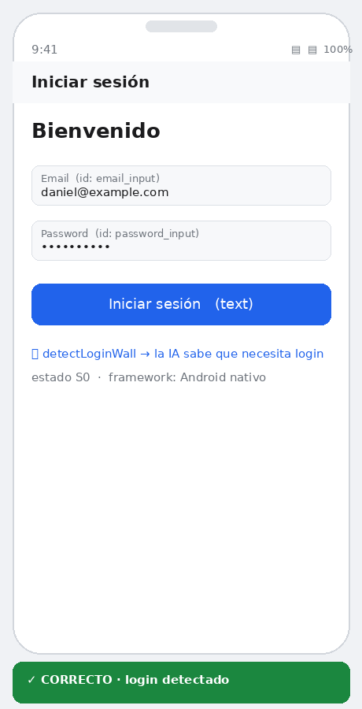
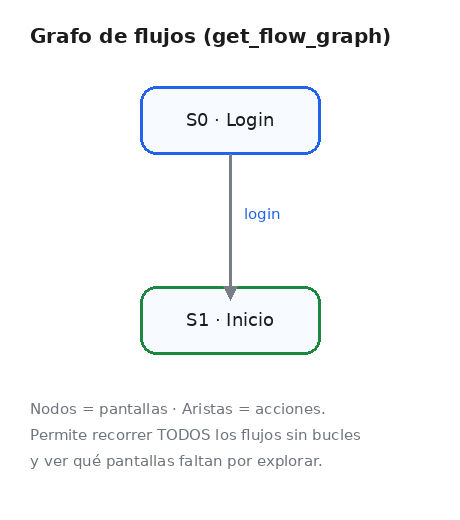

<div align="center">

<h1>📱 Mobiwright</h1>

<p><b>Testing end-to-end de apps móviles — estilo <a href="https://github.com/microsoft/playwright">Playwright</a>, con IA.</b></p>

<p>Comprueba automáticamente que tu app funciona en <b>Android</b> e <b>iOS</b> con una sola API,<br/>
y deja que una <b>inteligencia artificial</b> recorra tu app y te avise si algo se rompe.</p>

<p>


</p>

<p>
<a href="https://dan085.github.io/Mobiwright/"><b>🌐 Sitio web</b></a> &nbsp;·&nbsp;
<a href="#inicio-rápido"><b>🚀 Empezar</b></a> &nbsp;·&nbsp;
<a href="MCP.md"><b>🤖 IA / MCP</b></a> &nbsp;·&nbsp;
<a href="report/FLOW_REPORT.md"><b>🎬 Reporte de flujo</b></a>
</p>

<br/>





</div>

---

Escribe **un único test** y ejecútalo en Android e iOS. API familiar (`device`,
`getByRole`, `expect`), **auto-waiting** en cada acción, aserciones con reintento,
**trace** y **vídeo** del flujo — sin Appium ni servidores intermedios: hablamos
directamente con `adb`, `simctl` e `idb`.

```ts
import { test, expect } from "mobiwright";

test("login con credenciales válidas", async ({ device }) => {
  await device.getByTestId("email_input").fill("daniel@example.com");
  await device.getByTestId("password_input").fill("Sup3rSecret!");
  await device.getByRole("button", { name: "Iniciar sesión" }).tap();

  await expect(device.getByTestId("home_title")).toBeVisible();
});
```

> 💡 **¿No eres del equipo técnico?** Mobiwright es como un “probador” incansable:
> abre tu app en un teléfono virtual, la usa solo (toca, escribe, navega) y
> comprueba que todo funciona — dejándote un informe con capturas y vídeo. Mira el
> [sitio web](https://dan085.github.io/Mobiwright/) para entenderlo en 30 segundos.

---

## Índice

- [Por qué Mobiwright](#por-qué-mobiwright)
- [Comparativa](#comparativa)
- [Características](#características)
- [Instalación](#instalación)
- [Requisitos del sistema](#requisitos-del-sistema)
- [Setup automático](#setup-automático-del-entorno-nativo)
- [Inicio rápido](#inicio-rápido)
- [Conceptos: locators y auto-waiting](#conceptos-locators-y-auto-waiting)
- [Referencia de API](#referencia-de-api)
- [Referencia de configuración](#referencia-de-configuración)
- [CLI](#cli)
- [Revisión de flujos (trace)](#revisión-de-flujos-trace)
- [MCP: que una IA conduzca el flujo](#mcp-que-una-ia-conduzca-y-revise-el-flujo)
- [Modelos de IA recomendados](#modelos-de-ia-recomendados)
- [iOS desde Windows/Linux](#ios-desde-windowslinux)
- [Modo demo (sin emulador)](#modo-demo-sin-emulador)
- [CI](#ci)
- [Solución de problemas](#solución-de-problemas)
- [FAQ](#faq)
- [Roadmap](#roadmap)
- [Contribuir](#contribuir)
- [Licencia](#licencia)

## Por qué Mobiwright

Los tests de UI móvil son frágiles sobre todo por dos motivos: esperas mal
gestionadas (`sleep()`) y herramientas pesadas con muchas piezas. Mobiwright
ataca ambos copiando lo que hizo robusto a Playwright en web:

- **Auto-waiting** en cada acción: nada de `sleep()`.
- **API agnóstica de plataforma** sobre un **driver** fino: el mismo test corre
  en Android e iOS.
- **Sin servidor intermedio**: habla directo con `adb`/`simctl`/`idb`.
- **Pensado para IA**: incluye un servidor **MCP** para que cualquier modelo
  explore y valide los flujos.

## Comparativa

| | **Mobiwright** | Appium | Maestro | Detox |
|---|---|---|---|---|
| Android nativo | ✅ adb/uiautomator | ✅ | ✅ | ✅ |
| iOS nativo | ✅ simctl/idb | ✅ | ✅ | ✅ |
| Mismo test multiplataforma | ✅ | parcial | ✅ | parcial |
| Auto-waiting | ✅ | manual | ✅ | ✅ |
| Sin servidor intermedio | ✅ | ❌ (server) | ✅ | parcial |
| Trace navegable | ✅ | parcial | parcial | ❌ |
| Servidor MCP para IA | ✅ | ❌ | ❌ | ❌ |
| iOS remoto desde Win/Linux | ✅ (SSH) | parcial | ❌ | ❌ |
| Lenguaje de tests | TypeScript | varios | YAML | JS/TS |

> Comparativa orientativa; cada herramienta tiene fortalezas propias. Mobiwright
> prioriza simplicidad de stack, portabilidad del test y la integración con IA.

## Características

- **Multiplataforma real.** El mismo spec corre en Android (`adb` + `uiautomator`)
  e iOS (`simctl` + `idb`).
- **Auto-waiting.** Cada `tap`/`fill`/`expect` reintenta hasta que el elemento es
  accionable o vence el timeout.
- **Locators expresivos.** `getByText`, `getById`, `getByAccessibility`,
  `getByType`, XPath acotado y `.nth()`.
- **Aserciones auto-retrying.** `toBeVisible`, `toBeHidden`, `toHaveText`,
  `toContainText`, `toBeEnabled`, `toBeChecked`, `toHaveCount`, con `.not`.
- **Runner completo.** `describe`, hooks, reintentos, timeouts, filtros.
- **Evidencia automática.** Screenshot en fallo + trace HTML paso a paso.
- **Reporters.** `list` (consola), `html` y `json` (CI).
- **`mplay doctor`.** Diagnóstico de entorno (local y remoto) con remediación.
- **Servidor MCP.** Cualquier IA conduce y revisa el flujo (incl. detección de
  login).
- **iOS remoto por SSH.** Ejecuta iOS desde Windows/Linux contra un Mac remoto.
- **Modo demo (mock).** Pruébalo sin ningún emulador.
- **Sin dependencias pesadas.** Núcleo en TypeScript puro.

## Instalación

```bash
git clone https://github.com/dan085/Mobiwright.git && cd Mobiwright
npm install
npm run build
```

## Requisitos del sistema

| Plataforma | Necesitas | Instala con |
|-----------|-----------|-------------|
| **Android** | `adb` + emulador/AVD | `scripts/setup-android.sh` o Android Studio |
| **iOS (en Mac)** | Xcode CLT (`simctl`) + [`idb`](https://fbidb.io) | `scripts/setup-ios.sh` |
| **iOS (Windows/Linux)** | un **Mac remoto** por SSH | ver [SETUP.md](SETUP.md) |

Comprueba qué tienes y qué falta:

```bash
npx mplay doctor
npx mplay devices
```

## Setup automático del entorno nativo

Mobiwright puede **instalar las herramientas nativas que falten**:

```bash
bash scripts/setup-macos.sh     # macOS: Homebrew, Node, Android SDK+AVD, Xcode CLT, idb
./scripts/setup-windows.ps1     # Windows: Android nativo; iOS por Mac remoto
bash scripts/setup-android.sh   # solo Android (macOS/Linux)
bash scripts/setup-ios.sh       # solo iOS (macOS)
```

Guía detallada por SO en **[SETUP.md](SETUP.md)**.

## Inicio rápido

**1. Configura `mplay.config.ts`:**

```ts
import { defineConfig } from "mobiwright";

export default defineConfig({
  testDir: "./tests",
  retries: 1,
  use: { screenshot: "only-on-failure", trace: "retain-on-failure" },
  projects: [
    { name: "android", use: { platform: "android", app: "./apps/app-debug.apk", appId: "com.example.app", appActivity: ".MainActivity" } },
    { name: "ios", use: { platform: "ios", app: "./apps/App.app", appId: "com.example.App" } },
  ],
});
```

**2. Escribe tus tests** en `tests/*.spec.ts` (ver `tests/login.spec.ts` y
`tests/navigation.spec.ts`).

**3. Ejecuta:**

```bash
npx mplay test                    # todos los proyectos
npx mplay test --platform=android # solo Android
npx mplay test --grep="login"     # filtra por título
```

## Conceptos: locators y auto-waiting

Un **Locator** no apunta a un elemento concreto: describe **cómo encontrarlo**.
Cada acción re-evalúa el árbol de UI y **espera** (con polling) hasta que el
elemento existe y es accionable, o hasta agotar el timeout. Esto elimina los
`sleep()` y la causa principal de tests flaky. Es exactamente el modelo de
Playwright, trasladado a móvil. Los locators se adaptan a **cualquier tamaño de
pantalla** porque leen los `bounds` reales del árbol vivo.

## Referencia de API

### Fábricas de Locator (sobre `device`)

| Método | Equivalente Android / iOS |
|--------|---------------------------|
| `getByTestId("login")` | `resource-id` (RN testID) / `accessibilityIdentifier` |
| `getById("email_input")` | `resource-id` / `accessibilityIdentifier` |
| `getByRole("button", { name: "Entrar" })` | mapea rol → tipos nativos (button, textfield, text…) |
| `getByText("Aceptar")` / `getByText(/acept/i)` | texto visible (string o RegExp) |
| `getByAccessibility("Cerrar")` | `content-desc` / `accessibilityLabel` |
| `getByPlaceholder("Buscar…")` | placeholder / hint |
| `getByType("Button")` | clase nativa / `XCUIElementType` |
| `locatorXPath("//Button[@text='OK']")` | XPath acotado |

Roles soportados por `getByRole`: `button`, `textfield`, `text`, `image`,
`switch`, `checkbox`, `slider`, `list`, `header`, `link`, `listitem`, `tab`.

**Encadenamiento (chaining):** acota la búsqueda a los descendientes de otro
locator (por contención de bounds, funciona en Android e iOS):

```ts
// Toca el botón "Borrar" dentro de la primera celda de la lista
await device.getByRole("listitem").first().getByRole("button", { name: "Borrar" }).tap();
// Texto del título dentro de la barra de navegación
const t = await device.getByType("NavigationBar").getByRole("text").textContent();
```

### Acciones del Locator

| Método | Descripción |
|--------|-------------|
| `tap()` / `click()` | toca el centro del elemento (auto-wait) |
| `doubleTap()` | doble toque |
| `longPress(ms?)` | pulsación larga |
| `fill(text)` / `type(text)` | enfoca y escribe |
| `waitFor({state,timeout})` | espera `visible`/`attached` |
| `textContent()` | texto del elemento |
| `isVisible()` / `isEnabled()` / `isChecked()` | estado |
| `count()` | nº de coincidencias |
| `nth(i)` / `first()` | acota por índice |

### Acciones del Device

`swipe("up"|"down"|"left"|"right")` · `pressBack()` · `pressHome()` ·
`hideKeyboard()` · `setOrientation("portrait"|"landscape")` · `getOrientation()` ·
`getForegroundApp()` · `isAppInForeground(id)` · `launchApp(id)` ·
`terminateApp(id)` · `screenshot()` · `tree()` · `info()` · `waitForTimeout(ms)`

### Aserciones (`expect`, auto-retrying)

```ts
await expect(device.getById("home_title")).toBeVisible();
await expect(device.getById("home_title")).toBeHidden();
await expect(device.getById("welcome")).toHaveText("Hola");
await expect(device.getById("welcome")).toContainText("Hol");
await expect(device.getById("submit")).toBeEnabled();
await expect(device.getById("opt_in")).toBeChecked();
await expect(device.getByType("ProductCard")).toHaveCount(3);
await expect(device.getById("home_title")).not.toBeVisible();
```

## Referencia de configuración

`defineConfig({ ... })` acepta:

| Campo | Tipo | Por defecto | Descripción |
|-------|------|-------------|-------------|
| `testDir` | string | `./tests` | carpeta de specs |
| `testMatch` | RegExp | `/.*\.spec\.ts$/` | patrón de archivos |
| `timeout` | number | `60000` | timeout por test (ms) |
| `expect.timeout` | number | `10000` | timeout de aserciones |
| `retries` | number | `0` | reintentos por test |
| `workers` | number | `1` | proyectos/dispositivos en paralelo (override: `--workers=N`) |
| `reporter` | array | `[["list"]]` | `list` / `html` / `json` / `junit` |
| `use` | objeto | — | opciones por defecto (abajo) |
| `projects` | array | — | uno por plataforma/dispositivo |

Opciones de `use` (globales o por proyecto):

| Campo | Descripción |
|-------|-------------|
| `platform` | `"android"` \| `"ios"` |
| `app` | ruta al `.apk` / `.app` |
| `appId` | package id / bundle id |
| `appActivity` | Android: activity a lanzar |
| `deviceSerial` / `deviceUdid` | dispositivo concreto |
| `screenshot` | `"off"` \| `"on"` \| `"only-on-failure"` |
| `trace` | `"off"` \| `"on"` \| `"retain-on-failure"` |
| `video` | `"off"` \| `"on"` \| `"retain-on-failure"` (graba `.mp4` del flujo) |
| `actionTimeout` | timeout de acciones (ms) |
| `remoteHost` | `usuario@host` SSH (iOS remoto) |
| `sshArgs` | argumentos extra de ssh |

## CLI

```
mplay init                        Scaffold (config + test de ejemplo)
mplay test [--platform=android|ios] [--project=name] [--grep=texto] [--config=ruta]
mplay mcp                         Arranca el servidor MCP
mplay doctor [--platform] [--remote-host=u@mac]
mplay devices                     Lista emuladores/simuladores
mplay --help
```

Binarios equivalentes: `mplay`, `mobiwright`. Servidor MCP: `mobiwright-mcp`.

## Revisión de flujos (trace)

Cada acción se registra como un **paso del flujo** con su captura. Al terminar se
genera un **visor HTML navegable** por test (como el *trace viewer* de
Playwright):

```
mplay-results/<proyecto>/<test>/index.html
```

Política con `trace`: `"on"`, `"off"` o `"retain-on-failure"` (por defecto).

Además puedes grabar **vídeo** del flujo (`.mp4`) con `use: { video: "on" }`
(Android `screenrecord`, iOS `simctl recordVideo`). Se guarda junto al trace y
aparece enlazado en el informe HTML.

## MCP: que una IA conduzca y revise el flujo

Mobiwright incluye un **servidor MCP** (estándar abierto): una IA se conecta,
recibe el **árbol de accesibilidad** del emulador, ejecuta gestos y **revisa todo
el recorrido** de la app. Detecta pantallas de login y avisa "se necesita login
para ingresar"; con credenciales, entra; sin ellas, solo revisa.

```bash
npx mplay mcp
```

```json
{
  "mcpServers": {
    "mobiwright": { "command": "node", "args": ["/ruta/a/Mobiwright/dist/mcp/server.js"] }
  }
}
```

Tools: `open_app`, `snapshot`, `tap`, `fill`, `swipe`, `press_key`,
`assert_visible`, `login`, `get_flow`, `get_flow_graph`, `close_app`. Cada
`snapshot` anota el **estado en el grafo de flujos**, el **framework** detectado y
si hay **WebView**. Guía completa en **[MCP.md](MCP.md)**.

Para recorrer **todos los flujos** de forma sistemática, la IA usa
`get_flow_graph`: un grafo de pantallas y transiciones (con diagrama Mermaid) que
evita bucles y muestra qué falta por explorar.

> **Agnóstico de modelo.** Funciona con cualquier cliente MCP (Claude Desktop,
> Cursor, Cline, Continue, Windsurf, Zed, VS Code, ChatGPT/Gemini con MCP...) y,
> por tanto, con cualquier LLM.

## Modelos de IA recomendados

Mobiwright funciona con **cualquier modelo** con buen *tool calling*. Resumen
(detalle y fuentes en **[MODELS.md](MODELS.md)**):

| Caso | Recomendado |
|------|-------------|
| Máxima fiabilidad | Claude Opus 4.8 · GPT‑5.5 Pro · Gemini 3.1 Pro |
| Equilibrio coste/rendimiento | Claude Sonnet 4.6 · GPT‑5.4 · Gemini 3.5 Flash |
| Mejor visión (capturas) | Gemini 3 Flash (Agentic Vision) · Claude Opus 4.8 · GPT‑5.x |
| Rápido y económico | Claude Haiku 4.5 · Gemini 3.5 Flash |
| Local / privado | Qwen3‑Coder‑30B · GLM‑4.5‑Air · Llama 3.1 70B (Ollama) |

> El árbol de accesibilidad es texto, así que **no necesitas un modelo con visión**
> para empezar; la visión solo ayuda en casos ambiguos.

## iOS desde Windows/Linux

El Simulador de iOS solo existe en macOS. Mobiwright ejecuta `simctl`/`idb` en un
**Mac remoto por SSH** (`remoteHost`), así puedes lanzar iOS desde Windows o Linux
contra un Mac en la nube (GitHub Actions, MacStadium, MacInCloud), un device farm
o un Mac físico. Guía en **[SETUP.md](SETUP.md)**.

## Modo demo (sin emulador)

Prueba Mobiwright sin ningún dispositivo con el driver simulado:

```bash
npm run build
npm run verify       # batería de casos borde (tamaños, gestos, queries, login)
npm run test:demo    # flujo de login completo con el runner (mock)
```

## CI

[`.github/workflows/ci.yml`](.github/workflows/ci.yml) tiene tres jobs:

1. **build** — compila, typecheck, casos borde (`verify`), demo del runner y
   handshake MCP (sin dispositivo).
2. **android-e2e** — arranca un **emulador Android real**
   (`reactivecircus/android-emulator-runner`) y ejecuta `npm run test:ci`, que
   valida los drivers de extremo a extremo contra la app de **Ajustes** del
   sistema (sin necesidad de una APK propia). Sube el JUnit y los traces como
   artefactos.
3. **ios-e2e** — runner macOS con `idb` + `mplay doctor --platform=ios`.

La validación E2E usa [`mplay.ci.config.ts`](mplay.ci.config.ts) y
[`tests-ci/smoke.spec.ts`](tests-ci/smoke.spec.ts).

## Solución de problemas

| Síntoma | Causa / solución |
|---------|------------------|
| `No se pudo ejecutar 'adb'` | `adb` no está en el PATH → `scripts/setup-android.sh`. |
| `No hay emuladores/dispositivos` | Arranca un AVD: `emulator -avd <nombre>`. |
| Dispositivo *unauthorized* | Acepta el diálogo de depuración USB en el dispositivo. |
| `No hay simulador iOS booteado` | `open -a Simulator` o `xcrun simctl boot <UDID>`. |
| iOS en Windows/Linux | Usa `remoteHost` (Mac remoto). Ver SETUP.md. |
| Texto con acentos/emojis no se escribe | Limitación de `adb input text`; usa un IME de test (ADBKeyBoard). |
| Specs en `.ts` no cargan | `npm i -D ts-node` (incluido) o compila con `npm run build`. |

Más casos límite considerados en **[EDGE_CASES.md](EDGE_CASES.md)**.

## FAQ

**¿Necesito Appium?** No. Mobiwright habla directo con `adb`/`simctl`/`idb`.

**¿El mismo test corre en Android e iOS?** Sí, si usas selectores estables
(`getById`/`getByAccessibility`).

**¿Funciona con apps Kotlin/Swift nativas, React Native, Flutter o WebView?** Sí.
Guía por framework (estrategias y casos borde) en **[FRAMEWORKS.md](FRAMEWORKS.md)**.
Para Flutter, habilita la semántica de accesibilidad; para WebView, la
accesibilidad del WebView (DOM profundo vía CDP en Roadmap). Usa `getByTestId`
para selectores estables multiplataforma.

**¿Puedo usarlo sin IA?** Totalmente: el runner y la API funcionan solos. El MCP
es opcional.

**¿Qué modelo de IA uso?** Cualquiera con buen tool calling. Ver
[MODELS.md](MODELS.md).

## Roadmap

- Grabación de tests (codegen) desde gestos reales.
- Vídeo del flujo además del trace.
- Paralelismo multi-dispositivo (`workers > 1`).
- Driver para device farms (BrowserStack / Sauce Labs / AWS Device Farm).
- Espera por estado de red / inactividad de la app.
- Publicación en npm como `mobiwright`.

## Documentación

| Doc | Contenido |
|-----|-----------|
| [SETUP.md](SETUP.md) | Instalación del entorno nativo por SO; iOS remoto |
| [ARCHITECTURE.md](ARCHITECTURE.md) | Diseño interno (drivers, API, runner) |
| [FRAMEWORKS.md](FRAMEWORKS.md) | Kotlin/Swift, React Native, Flutter, WebView |
| [MCP.md](MCP.md) | Servidor MCP y uso con IA |
| [MODELS.md](MODELS.md) | Modelos de IA recomendados |
| [EDGE_CASES.md](EDGE_CASES.md) | Casos borde Android/iOS/tamaños |
| [AUDIT.md](AUDIT.md) | Auditoría de flujos y resoluciones |
| [INTEGRATIONS.md](INTEGRATIONS.md) | graphify y otras integraciones |
| [IMPROVEMENTS.md](IMPROVEMENTS.md) | Mejoras adoptadas de Mobilewright (crédito) |
| [report/FLOW_REPORT.html](report/FLOW_REPORT.html) · [.md](report/FLOW_REPORT.md) · [.pdf](report/FLOW_REPORT.pdf) | Reporte del flujo con imágenes y veredicto por situación |

## Publicar en GitHub (privado, para probarlo primero)

```bash
bash push.sh                 # crea dan085/Mobiwright como PRIVADO y hace push
bash push.sh <owner/repo>    # otro nombre
```

Con [GitHub CLI](https://cli.github.com) (`gh auth login`) el repo se crea
**privado** automáticamente. Sin `gh`, crea antes el repo privado en
<https://github.com/new> (marca *Private*) y reejecuta. Para cambiar uno
existente a privado: Settings → Danger Zone → Change visibility, o
`gh repo edit dan085/Mobiwright --visibility private`.

Alternativa: el archivo `Mobiwright.bundle` contiene el repo con el commit ya
hecho — `git clone Mobiwright.bundle Mobiwright`, añade tu remoto privado y push.

## Contribuir

Ver [CONTRIBUTING.md](CONTRIBUTING.md). Añadir una plataforma = implementar la
interfaz `Driver`. Antes de un PR: `npm run build` y `npm run verify` en verde.

## Licencia

[MIT](LICENSE) · © 2026 **Bimbask Inc**

---

> **Alcance honesto.** Mobiwright es una base arquitectónicamente completa y
> ejecutable que replica el modelo de Playwright para móvil e incorpora MCP. No
> es (todavía) un reemplazo 1:1 de toda la superficie de Playwright; ver el
> Roadmap. Las contribuciones son bienvenidas.
