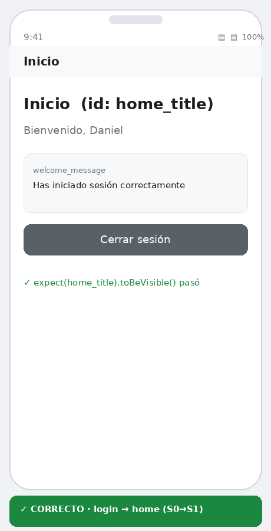
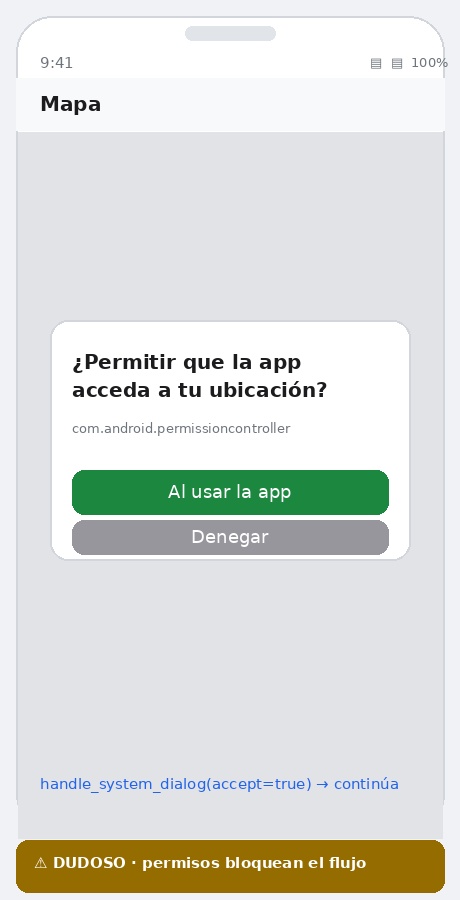
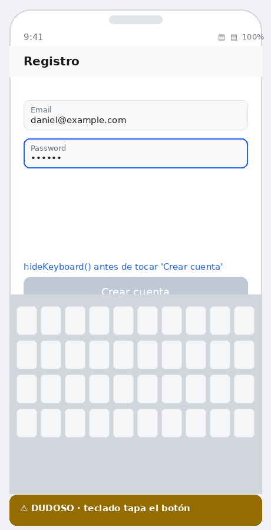
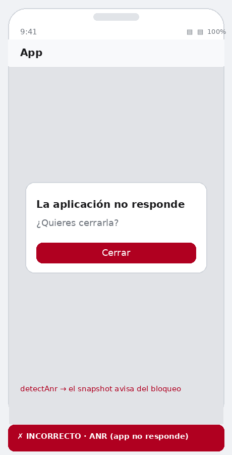
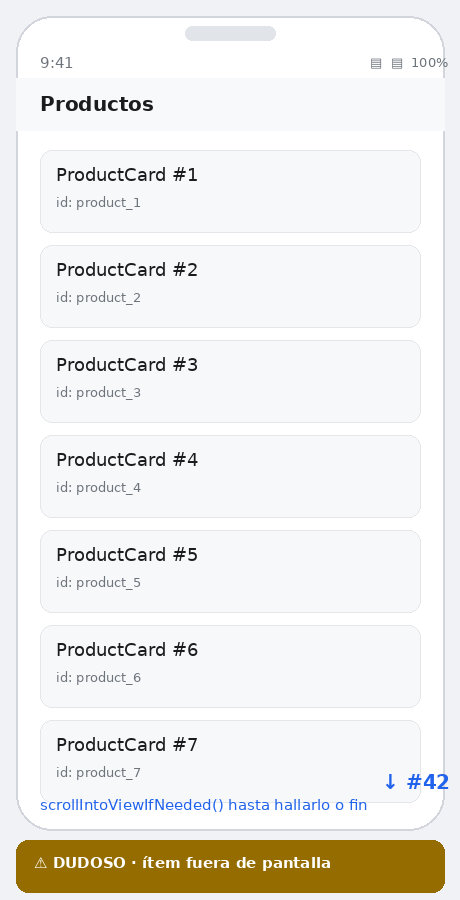
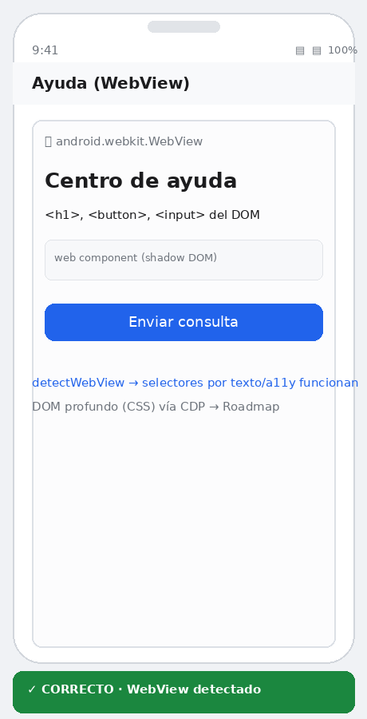
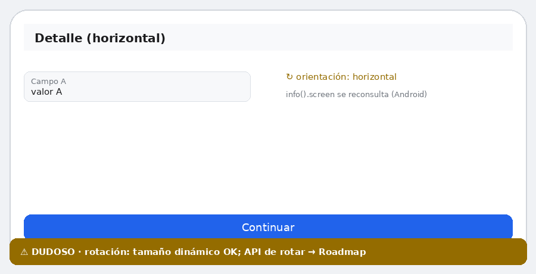
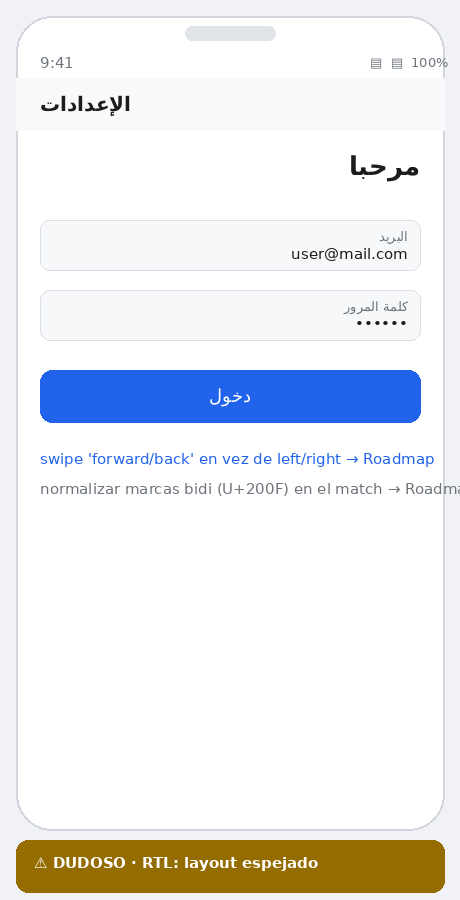
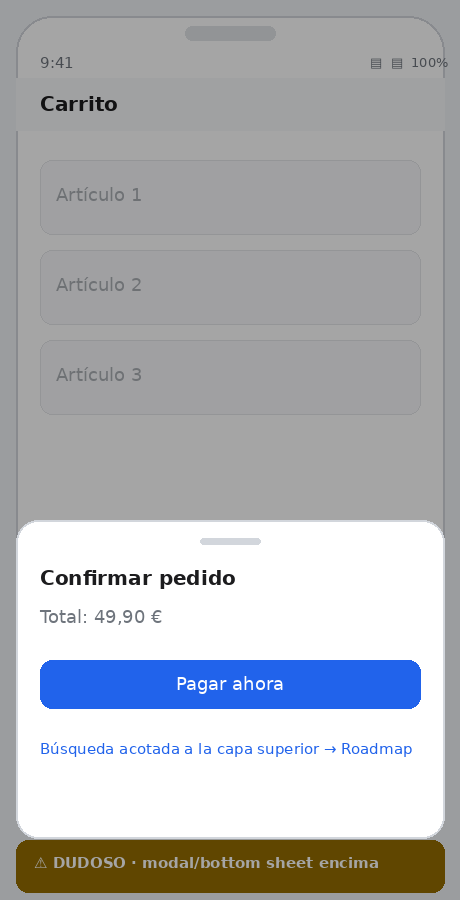
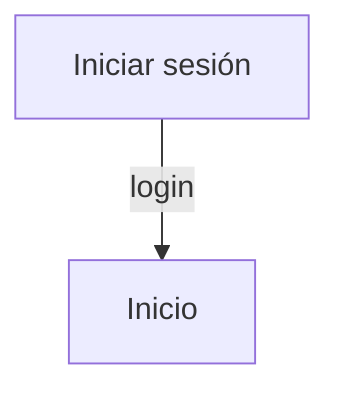

# Mobiwright — Reporte completo del flujo

Recorrido end-to-end con **veredicto por situación** (correcto / dudoso / incorrecto) e **imágenes para replicar** cada caso.

> Versión navegable con imágenes embebidas: [`FLOW_REPORT.html`](FLOW_REPORT.html) · PDF: [`FLOW_REPORT.pdf`](FLOW_REPORT.pdf)

## Resumen

| | Cantidad |
|---|---|
| ✓ Correcto | 4 |
| ⚠ Dudoso / requiere manejo | 6 |
| ✗ Incorrecto (error de la app, señalado) | 1 |

- **Dudoso** = situación del dispositivo que rompería el flujo si no se gestiona; Mobiwright la **detecta y ofrece la herramienta** para resolverla.
- **Incorrecto** = estado de error de la **app** (no del framework) que el framework **señala** para no confundirlo con un paso válido.

## Verificación automática (ejecutada)

| Comprobación | Resultado |
|--------------|-----------|
| Compilación TypeScript (`tsc`) | ✓ sin errores |
| Casos borde (`npm run verify`) | ✓ TODOS OK |
| Flujo de login (`npm run test:demo`) | ✓ 4 passed, 0 failed |
| Servidor MCP (13 tools, grafo) | ✓ operativo · S0→S1 |

## Situaciones del flujo

### 1. Pantalla de login — ✓ CORRECTO

- **Qué ocurre:** La app exige autenticarse para continuar.
- **Manejo:** `detectLoginWall` lo detecta; el snapshot avisa «se necesita login». La IA decide entrar (con credenciales) o solo revisar.
- **Replicar:** Abre la app en la pantalla de login → `snapshot`. Verás 🔐 y los campos email/password con sus ids.

### 2. Login correcto → Home — ✓ CORRECTO

- **Qué ocurre:** Con credenciales válidas se navega al home.
- **Manejo:** `login` rellena y envía; `expect(home_title).toBeVisible()` confirma. La transición S0→S1 queda en el grafo.
- **Replicar:** `login {username,password}` → `assert_visible id=home_title` → `get_flow_graph`.

### 3. Diálogo de permisos — ⚠ DUDOSO

- **Qué ocurre:** Un diálogo de sistema (ubicación, cámara…) tapa la app y bloquea el flujo.
- **Manejo:** `detectSystemDialog` lo identifica (Android permissioncontroller / iOS alert) y lo anota; la tool `handle_system_dialog(accept)` responde.
- **Replicar:** Provoca un permiso runtime (p.ej. pedir ubicación) → `snapshot` muestra 🛡️ → `handle_system_dialog accept=true`.

### 4. Teclado tapa el botón — ⚠ DUDOSO

- **Qué ocurre:** Tras enfocar un campo, el teclado software cubre el botón de enviar.
- **Manejo:** `Device.hideKeyboard()` / tool `hide_keyboard` cierra el IME (Android lo detecta y pulsa BACK) antes de tocar el botón.
- **Replicar:** Enfoca un campo cercano al borde inferior, intenta tocar el botón → llama `hide_keyboard` y reintenta.

### 5. App no responde (ANR) — ✗ INCORRECTO

- **Qué ocurre:** La app se congela o crashea; aparece el diálogo del sistema «no responde».
- **Manejo:** `detectAnr` lo detecta y el snapshot avisa 💥, para no confundir el diálogo con una pantalla válida del flujo.
- **Replicar:** Fuerza un bloqueo del hilo principal (build de prueba) → `snapshot` muestra el aviso de ANR.

### 6. Elemento fuera de pantalla — ⚠ DUDOSO

- **Qué ocurre:** Un ítem de una lista larga (RecyclerView/FlatList) no está en el árbol hasta hacer scroll.
- **Manejo:** `scrollIntoViewIfNeeded()` y el scroll automático en `tap/fill` y en el MCP desplazan hasta hallarlo o hasta el fin de la lista.
- **Replicar:** `tap by=id value=product_42` en una lista larga: hace scroll solo hasta encontrarlo.

### 7. WebView / app híbrida — ✓ CORRECTO

- **Qué ocurre:** Pantalla con contenido web embebido (WebView / web components).
- **Manejo:** `detectWebView` lo anota; si el WebView expone accesibilidad, sus nodos (incl. shadow DOM abierto) se alcanzan con `getByText`/`getByAccessibility`.
- **Replicar:** Abre una pantalla con WebView → `snapshot` muestra 🌐. (DOM profundo CSS vía CDP → Roadmap.)

### 8. Grafo de flujos — ✓ CORRECTO

- **Qué ocurre:** Para recorrer TODOS los flujos sin perderse ni repetir.
- **Manejo:** Cada `snapshot` registra el estado (NUEVO/visitado); `get_flow_graph` devuelve nodos (pantallas) y aristas (acciones) con diagrama Mermaid.
- **Replicar:** Explora la app con la IA y pide `get_flow_graph`: verás qué pantallas faltan por visitar.

### 9. Rotación / orientación — ⚠ DUDOSO

- **Qué ocurre:** El dispositivo rota a horizontal a mitad del flujo y cambian las dimensiones.
- **Manejo:** El tamaño de pantalla se reconsulta dinámicamente (Android) y el swipe usa el área real; el árbol se re-vuelca tras rotar.
- **Replicar:** Rota el emulador (`adb shell settings put system user_rotation 1`) y repite un `snapshot`. (API de rotar integrada → Roadmap.)

### 10. Layout RTL (árabe/hebreo) — ⚠ DUDOSO

- **Qué ocurre:** Idiomas de derecha a izquierda: la UI se muestra espejada.
- **Manejo:** Los selectores por id/texto/a11y siguen funcionando y el tap usa bounds reales; los swipes direccionales y las marcas bidi requieren manejo semántico.
- **Replicar:** Cambia el locale del device a `ar`/`he` y recorre el flujo. (swipe forward/back y normalización bidi → Roadmap.)

### 11. Modal / bottom sheet — ⚠ DUDOSO

- **Qué ocurre:** Una hoja inferior o diálogo modal se superpone sobre la pantalla.
- **Manejo:** El modal se registra como un estado nuevo en el grafo; conviene acotar la búsqueda a la capa superior mientras esté presente.
- **Replicar:** Abre un bottom sheet → `snapshot` (nuevo estado). (Acotado a la capa superior → Roadmap.)

## Grafo de flujos real

Detalle técnico en [AUDIT.md](../AUDIT.md), [EDGE_CASES.md](../EDGE_CASES.md) y [FRAMEWORKS.md](../FRAMEWORKS.md).
